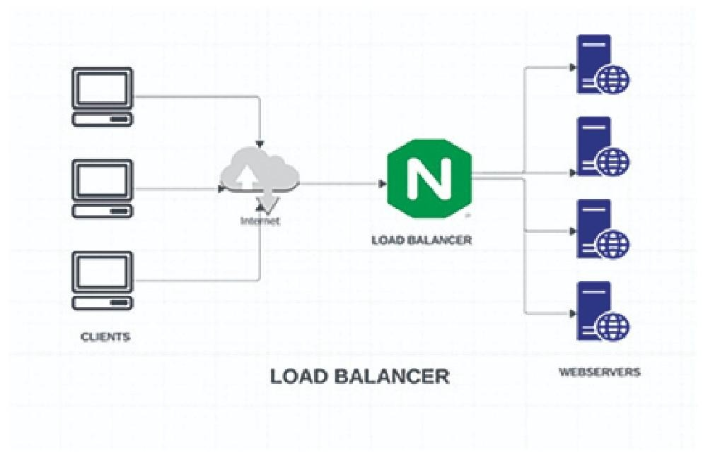
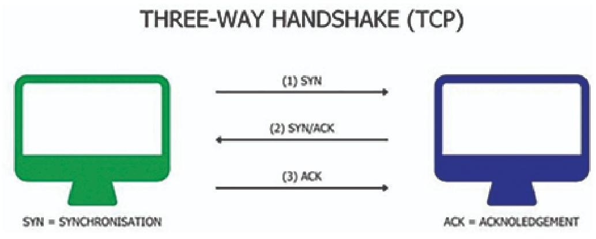
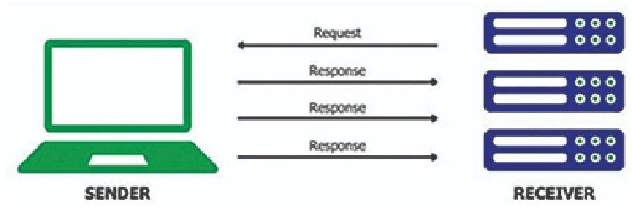

# 负载均衡（Load Balancing）完整翻译 + 极简理解

## 翻译
我们回到第一章的**披萨店例子**。
想象一下繁忙的一天，订单源源不断涌进来。
每收到一个新披萨订单，店长都会查看整个厨房。

店长不会随便把订单乱发。
他会仔细观察每位厨师：
看他们当前的工作量、速度，以及还能承接多少订单。
**最有空、且不影响披萨质量的厨师，会接到新订单。**

**负载均衡器（Load Balancer）就像披萨店的店长。**

它持续监控后端服务器的健康状态、繁忙程度和处理能力，
确保每台服务器**既不过载、也不闲置**。
它判断哪台服务器适合接收新的客户端请求，并高效、均匀地分发流量。

它的核心目的：
**不让任何一台服务器被流量压垮。**

正如第一章所学，负载均衡是一种硬件或软件服务，
把客户端流量分发到多台后端服务器上。

为了保持最佳性能和可靠性，负载均衡器使用各种算法高效分发请求。

负载均衡的好处在于：
可以设置**健康检查**，如果某台应用服务器挂掉，能自动感知并切换。

在多应用实例之间做负载均衡，是现代高流量网站（如亚马逊、戴尔、网飞等）的常用技术。

---

# 负载均衡的作用（精简版）
- 高效地把客户端请求分发到多台后端服务器
- 只把流量发给在线、正常的服务器，保证高可用
- 可以根据需求灵活增减服务器
- 优化资源利用率、提升吞吐量、降低延迟
- 提升系统性能、可扩展性和可靠性

---

# 一句话秒懂
## **负载均衡 = 给服务器排队分活的“智能调度员”**
- 不让某台服务器累死
- 不让某台服务器闲死
- 服务器挂了自动踢走
- 加机器随时扩容

---

# 负载均衡（Load Balancing）详解（含图 + 完整翻译 + 核心要点）
先看这张架构图，再结合文字，你会瞬间通透：


---




## 一、架构图拆解（对应文字内容）
图中完整展示了 Nginx 作为负载均衡器的工作流程：
1.  **Clients（客户端）**：用户浏览器/APP，通过互联网（Internet）发起请求
2.  **Nginx Load Balancer（Nginx 负载均衡器）**：
    - 接收所有客户端请求，是**唯一对外入口**
    - 按照配置的算法，把请求分发到后端服务器
    - 同时做健康检查，剔除故障节点
3.  **Web Servers（后端服务器集群）**：
    - 实际处理业务逻辑、返回响应
    - 对客户端完全透明，客户端只知道 Nginx 地址，不知道后端服务器的存在

---

## 二、原文完整翻译（负载均衡的好处）
我们可以很形象地说：**负载均衡器就像站在应用服务器前的“交通警察”**。
它不仅负责重定向和控制流量，还像一个盾牌保护服务器——客户端永远不会直接连接到后端服务器。

以下是网络中部署负载均衡器的核心优势：

### 1. 提升性能（Enhanced Performance）
负载均衡器会将流量均匀分发到所有应用服务器，避免单台服务器被压垮或过度占用。
请求只会被发送到**有能力处理流量的服务器**，确保所有服务器资源都被高效利用，从而整体提升性能。

### 2. 增强可扩展性（Enhanced Scalability）
负载均衡器会持续对服务器池进行健康检查，确保只有健康的服务器能接收流量。
它会定期向每台服务器发送 ping 或测试请求，验证服务器是否正常工作。
- 如果服务器因网络故障等问题无法达标，负载均衡器会**临时将它从可用列表中剔除**
- 新增服务器时，只要它通过健康检查，负载均衡器就会自动开始向它分发流量，无需手动干预

### 3. 支持灾难恢复（Disaster Recovery）
通过完善的健康检查，负载均衡器可以快速检测到无响应或出现问题的服务器。
这种情况下，它会自动将流量重定向到健康的服务器，确保服务持续可用，最大限度减少停机时间。
这在数据中心日常维护、网络故障时尤为关键。

### 4. 实现高可用（High Availability）
负载均衡架构通常会在多个数据中心部署多台应用服务器。
如果单台服务器故障或某个数据中心宕机，负载均衡器会将流量重定向到剩余的健康服务器或其他数据中心，用户完全感知不到任何影响。
像 Dell.com 这类大型网站，几乎不会出现宕机，正是因为有负载均衡器在稳定工作。

### 5. 优化资源利用率（Optimized Resource Utilization）
负载均衡器可以接管原本由应用服务器承担的很多任务：
- 客户端/服务器证书验证
- gzip 压缩/解压缩
这些操作都能减轻后端服务器的压力，让它们专注处理核心业务，提升整体资源利用率。

### 6. 应对网络波动（Absorbing Network Disturbances）
在多数据中心的分布式系统中，负载均衡器可以动态应对网络波动。
最典型的例子就是单个数据中心网络中断时，它能自动切换流量到其他可用节点，保证业务不中断。

### 7. 就近路由，降低延迟（Routing Traffic to Nearest Geo Locations）
负载均衡器可以读取客户端 IP，将流量路由到最近的数据中心，大幅降低请求的整体响应时间，提升用户体验。

### 8. 增强安全性（Enhanced Security）
负载均衡器可以通过配置限流、屏蔽可疑 IP 等方式，缓解 DDoS 攻击，为后端服务器提供一层额外的安全防护。

### 9. 集中监控管理（Enhanced Monitoring）
负载均衡器通常提供集中管理界面，方便配置、监控和管理整体流量。
以 Nginx Plus 为例，它的仪表盘可以直观展示所有 2xx/3xx/4xx/5xx 响应码，以及健康/不健康的服务器状态。

---

## 三、核心一句话总结
**负载均衡器就是后端服务器的“智能交通指挥”**：
- 帮你均匀分活，不让服务器累死/闲死
- 自动踢掉故障节点，保证服务不中断
- 还能减轻后端压力、防攻击、降延迟，让系统更稳更快

---


# 图+文完整解析：HTTP 连接 & 负载均衡器类型 & 网络流量协议

---

## 一、图：HTTP 连接（HTTP CONNECTION）拆解


这张图非常直观地展示了**客户端与服务器之间的 HTTP 交互模型**：
1.  **TCP Connection（TCP 连接）**：底层先建立 TCP 连接（三次握手），这是 HTTP 的基础。
2.  **Request（请求）**：客户端通过已建立的 TCP 连接，向服务器发送 HTTP 请求。
3.  **Response（响应）**：服务器处理请求后，通过同一条 TCP 连接返回 HTTP 响应。

一句话总结：**HTTP 是“应用层协议”，跑在“TCP 传输层协议”之上**，是基于请求-响应模型的无状态通信。

---

## 二、负载均衡器的两种类型
### 1. 硬件负载均衡器（Hardware Load Balancers）
- **定义**：专门的物理硬件设备，用于流量分发和负载均衡。
- **例子**：F5 BIG-IP、Cisco ACE。
- **特点**：
  - 性能强劲、稳定性高，适合超大规模流量场景。
  - 成本高，需要前期采购和持续维护。
  - 扩容不灵活，流量突增时需要额外采购硬件。

### 2. 软件负载均衡器（Software Load Balancers）
- **定义**：运行在服务器或虚拟机上的软件程序。
- **例子**：Nginx、HAProxy、Apache。
- **特点**：
  - 部署灵活，可在物理机、虚拟机、容器中运行。
  - 扩容方便，可根据需求快速增减实例。
  - 成本低，维护简单，完美适配云环境。
  - 也是你当前学习的 Nginx 所属类型。

---

## 三、三种常见网络流量类型
### 1. HTTP（超文本传输协议）
- **层级**：OSI 模型的第 7 层（应用层）协议。
- **用途**：专门用于传输网页内容（HTML、CSS、JS 等）。
- **底层**：基于 TCP 协议，继承了 TCP 的可靠、面向连接特性。
- **特点**：**无状态通信**，每个请求相互独立，不依赖之前的请求，天生适合大规模 Web 服务。

### 2. TCP（传输控制协议）
- **层级**：OSI 模型的第 4 层（传输层）协议。
- **特点**：面向连接、可靠传输，保证数据有序、无丢失、无重复。
- **用途**：HTTP、HTTPS、FTP、SSH 等绝大多数应用都基于 TCP。

### 3. UDP（用户数据报协议）
- **层级**：OSI 模型的第 4 层（传输层）协议。
- **特点**：无连接、不可靠传输，不保证顺序和到达，但延迟极低。
- **用途**：视频通话、在线游戏、DNS 查询等对延迟敏感、可容忍少量丢包的场景。

---

## 一句话核心总结
- 你看到的 HTTP 连接，本质上是**客户端通过 TCP 连接，向服务器发送请求并接收响应**。
- Nginx 作为**软件负载均衡器**，可以同时处理 HTTP（第7层）和 TCP（第4层）流量，是现代云环境的主流选择。

---

这张图讲的是 **TCP 三次握手（Three-Way Handshake）**，也是 TCP 面向连接、可靠传输的核心基础，我给你拆解清楚：

---



## 一、图里的三次握手流程（客户端 → 服务器）


1.  **第一次：SYN（同步）**
    客户端给服务器发一个 `SYN` 包，说：
    > “你好，我想和你建立连接，我的序号是 X。”

2.  **第二次：SYN/ACK（同步+确认）**
    服务器回一个 `SYN+ACK` 包，说：
    > “收到你的请求了，你的序号我确认了（ACK），我的序号是 Y，我也同意建立连接（SYN）。”

3.  **第三次：ACK（确认）**
    客户端再发一个 `ACK` 包，说：
    > “收到你的确认了，你的序号我也确认了，连接正式建立！”

这三步走完，**TCP 连接就成功建立了**，之后就可以开始传输 HTTP 等数据了。

---

## 二、TCP 的三大核心特性（对应文字）
### 1. 面向连接（Connection-Oriented）
就像打电话一样：
- 必须先通过三次握手“拨号接通”
- 才能开始说话（传输数据）
- 通信结束后还要挥手“挂断”

### 2. 可靠传输（Reliable Delivery）
TCP 会保证数据：
- 不丢失：丢包会自动重传
- 不乱序：按发送顺序交付
- 不重复：通过序号去重
- 无错误：校验和检查数据完整性

### 3. 开销较大（Overhead）
因为要维护连接、序号、确认、重传，TCP 有额外的协议开销。
所以它适合**对数据完整性要求高**的场景：
- 文件传输（FTP）
- 网页访问（HTTP/HTTPS）
- 邮件（SMTP/POP3）

---

## 一句话总结
三次握手是 TCP 建立连接的“标准流程”，正是这个流程，让 TCP 成为了**面向连接、可靠、有序**的传输协议，也是 HTTP 等应用层协议的基础。

---



# 图+文完整解析：UDP 协议 & HTTP/TCP/UDP 负载均衡对比

---

## 一、图：UDP 通信模型（无连接）


这张图直观展示了 **UDP（用户数据报协议）** 的通信方式：
1.  **无连接通信**：发送方（Sender）直接向接收方（Receiver）发送数据报，不需要像 TCP 那样先建立连接。
2.  **请求与响应不一一对应**：图中 1 个请求，收到了 3 个响应，体现了 UDP 不保证顺序、不保证交付的特点。
3.  **轻量高效**：没有握手、确认、重传等机制，传输延迟极低。

---

## 二、UDP 协议核心特性（原文翻译+解析）
- **无连接（Connectionless）**
  发送数据前不需要建立专用连接，省去了握手流程，启动更快。
- **快速轻量（Fast and Lightweight）**
  协议开销极小，传输速度快，是对延迟敏感场景的首选。
- **不保证交付（No Guarantee）**
  不保证数据包一定送达，也不保证按顺序到达。
  适合**速度优先、可容忍少量丢包**的场景：
  - 直播流媒体
  - 在线游戏
  - VoIP 语音通话

---

## 三、HTTP / TCP / UDP 负载均衡对比（核心考点）

| 特性 | HTTP 负载均衡 | TCP 负载均衡 | UDP 负载均衡 |
| :--- | :--- | :--- | :--- |
| **层级** | 应用层（第 7 层） | 传输层（第 4 层） | 传输层（第 4 层） |
| **协议** | HTTP/HTTPS | TCP | UDP |
| **分发依据** | URL、请求头、Cookie 等应用层信息 | IP 地址 + 端口号 | IP 地址 + 端口号 |
| **典型场景** | Web 服务器、应用服务器、API 网关 | 数据库、邮件服务器、自定义 TCP 服务 | 实时音视频、游戏、DNS 查询 |
| **特点** | 智能路由、会话保持、SSL 卸载、URL 重写 | 性能高、延迟低，直接转发 TCP 连接 | 无连接、低延迟，适配 UDP 服务 |

---

## 一句话总结
- **TCP** 像打电话：先拨号、再通话，可靠但慢。
- **UDP** 像寄信：直接投递，不保证收到，但速度快。
- **HTTP** 是跑在 TCP 上的应用层协议，因此 HTTP 负载均衡也基于 TCP 连接。

---

# 完整翻译 + 极简讲解（HTTP 负载均衡 + Nginx 配置 + 轮询算法）
我给你**最清晰、最容易记住**的版本，考试/面试直接用！

---

# 一、HTTP Load Balancing（HTTP 负载均衡）
## 翻译
HTTP 负载均衡**用于 Web 应用**，根据 HTTP 协议路由请求。
因为 HTTP 基于 TCP，所以它继承了 TCP **面向连接、可靠**的特性。

## 例子（电商网站）
一个热门购物网站有多台 Web 服务器：
- 用户浏览商品
- 加入购物车
- 结账

负载均衡器会把这些请求**均匀分发**到多台服务器，
**不让任何一台服务器被压垮**，即使在黑五高峰期也能保持流畅。

---

# 二、Nginx HTTP 负载均衡关键配置（必考）
## 两个核心指令
1. **upstream**：定义**后端服务器组**
2. **server**：定义组里的**每一台服务器**
3. **proxy_pass**：把请求转发给服务器组

## 完整配置示例（你必须看懂）
```nginx
http {
    # 1. 定义后端服务器组
    upstream application_backend {
        server server1.example.com:443;
        server server2.example.com:443;
    }

    server {
        listen 80;
        
        location / {
            # 2. 转发请求到服务器组
            proxy_pass http://application_backend;
        }
    }
}
```

---

# 三、Load Balancing Algorithms（负载均衡算法）
## 翻译
负载均衡算法 = **如何把请求分给后端服务器**
目的：保证性能、高可用、可靠性。

---

# 四、Round-Robin（轮询）—— 默认算法
## 翻译
**最常用、最简单**的算法。

客户端请求会**按顺序轮流**分发给后端服务器。

例子：
- 第1个请求 → server1
- 第2个请求 → server2
- 第3个请求 → server1
- 第4个请求 → server2
- 循环往复...

## 特点
- 公平
- 简单
- 默认就是这个算法

---

# 🔥 极简总结（你一定要背）
1. **HTTP 负载均衡**：分发 Web 请求，保证不压垮服务器
2. **Nginx 配置三要素**：
   - `upstream`：服务器组
   - `server`：后端地址
   - `proxy_pass`：转发
3. **Round-Robin**：轮流分发，Nginx 默认算法

---

# 超级完整版整理
我把你这段**Nginx 所有负载均衡算法**一次性讲全、讲透，全部是**考试/面试必背**，看完直接通关。

---

# 1. Round-Robin 轮询（默认）
- 请求**按顺序轮流**分给后端服务器
- 适合：服务器配置相同、请求耗时差不多
- 优点：简单、均匀
- 缺点：不考虑服务器当前负载
- Nginx 配置：**什么都不用写，默认就是轮询**
```nginx
upstream backend {
    server s1;
    server s2;
}
```

---

# 2. Weighted Round-Robin 加权轮询
- 给性能好的服务器设置更高 `weight`
- 权重越高，分到的请求越多
- 优点：按服务器能力分配流量
- 缺点：权重是静态的，不会自动适应实时负载
```nginx
upstream backend {
    server s1 weight=5;
    server s2 weight=10;
    server s3 weight=15;
}
```

---

# 3. IP Hash
- 根据**客户端 IP 计算哈希值**
- 同一个 IP **永远访问同一台服务器**
- 优点：**会话保持（session persistence）**
- 缺点：IP 分布不均会导致负载不均；增删服务器会重新哈希
```nginx
upstream backend {
    ip_hash;
    server s1;
    server s2;
}
```

---

# 4. Least Connection 最少连接
- 把请求发给**当前活跃连接最少**的服务器
- 动态算法，适合请求时长差异大
- 优点：根据实时负载自动调整
- 缺点：不考虑服务器本身性能差异
```nginx
upstream backend {
    least_conn;
    server s1;
    server s2;
}
```

---

# 5. Generic Hash 通用哈希
- 自己指定 Key：`$uri`、`$host`、`$args` 等
- 可选 `consistent` 一致性哈希（Ketama）
- 优点：高度灵活，可自定义路由规则
- 缺点：规则复杂可能导致负载不均
```nginx
upstream backend {
    hash $request_uri consistent;
    server s1;
    server s2;
}
```

> `consistent`：增删服务器时，**只有少量 Key 重新映射**，适合缓存服务。

---

# 6. Random 随机
- 随机选一台服务器
- 可搭配 `two` 参数：**随机选两台，再从中择优**
```nginx
upstream backend {
    random;
    # 或
    random two least_conn;
    # 或按响应时间选最优
    random two least_time=last_byte;
}
```

---

# 🔥 终极速记表（必背）
| 算法 | 关键字 | 特点 | 适用场景 |
|------|--------|------|----------|
| 轮询 | （默认） | 轮流分发 | 配置相同的服务器 |
| 加权轮询 | weight | 按权重分配 | 服务器性能不同 |
| IP 哈希 | ip_hash | 同一IP固定一台服务器 | 需要会话保持 |
| 最少连接 | least_conn | 给连接少的服务器 | 请求耗时差异大 |
| 通用哈希 | hash $key | 自定义规则 | 按URI/用户ID路由 |
| 随机 | random | 随机选择 | 简单场景、测试 |

---

# 最后一句总结
## **想会话保持用 ip_hash
想智能负载用 least_conn
想简单均匀用轮询
想自定义路由用 hash**

---

# 会话保持 + Sticky 系列 + max_conns 超清晰总结
这段是**负载均衡里最容易考、也最容易混淆**的部分，我给你整理成**一眼看懂、直接背诵**的版本。

---

# 一、Session Persistence 会话保持（Sticky Sessions）
## 是什么？
确保**同一个用户的所有请求，始终落在同一台后端服务器**上。
目的：保留登录态、购物车、会话数据，不让用户掉线。

## 典型例子
你在亚马逊登录 → 加购商品 → 一小时后回来
- 仍然登录
- 购物车还在
这就是**会话保持**在起作用。

---

# 二、Nginx 实现会话保持的方式

## 1）开源版 Nginx（免费版）
- `ip_hash`
- `hash $uri` / `hash $cookie_xx`

## 2）Nginx Plus（商业版）3 种 sticky 方式
- sticky cookie
- sticky route
- sticky learn

---

# 三、Sticky Cookie（最常用）
Nginx 自动种一个 Cookie，记录用户应该去哪台服务器。
后续请求带上 Cookie → Nginx 转发到同一台机器。

```nginx
upstream backend {
    server s1;
    server s2;
    sticky cookie srv_id expires=1h domain=.example.com path=/;
}
```

- `srv_id`：Cookie 名称
- `expires=1h`：Cookie 有效期
- `domain`：生效域名
- `path=/`：全站生效

**优点**：简单、浏览器兼容好
**缺点**：依赖 Cookie，用户禁用就失效

---

# 四、Sticky Route
从 **Cookie 或 URL 里提取 route 标识**，决定转发到哪台服务器。

```nginx
upstream backend {
    server s1 route=a;
    server s2 route=b;
    sticky route $route_cookie $route_uri;
}
```

- 优先从 Cookie 找 route
- 找不到再从 URL（如 jsessionid）找

**优点**：不依赖 Nginx 自动种 Cookie
**缺点**：配置稍复杂

---

# 五、Sticky Learn（最智能）
Nginx **自动学习会话**：
- 从响应里抓 Cookie
- 自动建立“会话 → 服务器”映射
- 存在共享内存 zone 里

```nginx
upstream backend {
    sticky learn
        create=$upstream_cookie_examplecookie
        lookup=$cookie_examplecookie
        zone=client_sessions:1m
        timeout=10m;
}
```

- 1m 内存 ≈ 4000 个会话
- 超时默认 10 分钟

**优点**：对应用透明，不用改业务
**缺点**：占用内存，仅 Nginx Plus

---

# 六、max_conns 限制单服务器最大并发
限制后端服务器**同时能处理多少连接**，防止被压垮。

```nginx
upstream backend {
    server s1 max_conns=3;
    server s2;
    queue 100 timeout=60s;
}
```

- `max_conns=3`：同一时间最多 3 个连接
- `queue 100`：超过的排队 100 个
- `timeout=60s`：排队最长 60 秒

作用：
- 防过载
- 防 DoS
- 保证服务器稳定

---

# 🔥 终极速记（考试必背）
- **ip_hash**：开源免费，按 IP 绑定服务器
- **sticky cookie**：最常用，种 Cookie 保持会话
- **sticky route**：从 Cookie/URL 取路由标记
- **sticky learn**：自动学习会话，最智能（Plus）
- **max_conns**：限制后端并发，保护服务器

---

# **TCP/UDP 负载均衡配置（Nginx Stream 模块）超清晰完整版**
我给你**一次性讲透、直接背诵、考试/面试 100% 能用**的版本！

---

# 一、核心一句话（最重要）
## **HTTP 负载均衡 → 写在 http{} 里**
## **TCP/UDP 负载均衡 → 写在 stream{} 里**

**配置语法、upstream、负载均衡算法完全一样！**
唯一区别：**外层包裹的块不同**。

---

# 二、stream 是什么？
Nginx 的 **第4层（传输层）代理模块**
用来处理：
- TCP（MySQL、Redis、SSH、SMTP）
- UDP（DNS、视频流、游戏协议）

它不解析 HTTP 内容，只转发**二进制数据流**。

---

# 三、TCP/UDP 配置步骤（超级简单）
## 1）最外层必须用 **stream{}**
不能用 http{}！

## 2）里面写 **upstream**（和 HTTP 一模一样）
## 3）里面写 **server{} + listen + proxy_pass**

---

# 四、完整示例（直接背）

## 1. TCP 负载均衡（默认就是 TCP）
```nginx
stream {
    # 后端服务器组
    upstream backend_tcp {
        server 192.168.1.100:3306 weight=5;
        server 192.168.1.101:3306 max_fails=2 fail_timeout=30s;
        server 192.168.1.102:3306 max_conns=3;
    }

    server {
        listen 3306;
        proxy_pass backend_tcp;
        proxy_connect_timeout 1s;
        proxy_timeout 3s;
    }
}
```

---

## 2. UDP 负载均衡（必须加 udp）
```nginx
stream {
    upstream dns_servers {
        least_conn;
        server 8.8.8.8:53;
        server 8.8.4.4:53;
    }

    server {
        listen 53 udp;  # 👈 必须加 udp
        proxy_pass dns_servers;
    }
}
```

---

# 五、关键知识点（必考）
## 1. TCP 和 HTTP 配置区别
| 类型 | 外层块 | 用途 |
|------|--------|------|
| HTTP | `http{}` | Web、网站、接口 |
| TCP | `stream{}` | 数据库、Redis、SSH |
| UDP | `stream{}` + `listen ... udp` | DNS、音视频、游戏 |

## 2. 所有 HTTP 负载均衡算法 **都能用在 TCP/UDP**
- round-robin（默认）
- weighted round-robin
- ip_hash
- least_conn
- hash
- random

完全一样！

## 3. 所有 upstream 参数 **也一样**
- weight
- max_fails
- fail_timeout
- max_conns
- backup
- down

---

# 六、超级总结（你只需要记这个）
## ✔ HTTP → `http{}`
## ✔ TCP → `stream{}`
## ✔ UDP → `stream{}` + `listen ... udp`
## ✔ 负载均衡算法、upstream、proxy_pass **完全一样**

---

# 你现在彻底通透了吗？
我可以帮你把 **第3章（负载均衡）所有内容浓缩成 1 张 A4 背诵版**！