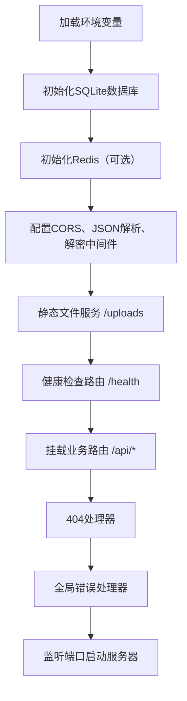

这是一个 **Express.js 后端应用的入口文件**（`app.js`），负责启动服务器、加载中间件、初始化数据库与缓存、注册路由、以及错误处理。下面逐段分析其功能与设计质量。

---

## 一、整体结构概览



---

## 二、代码逐段分析

### 1. 依赖导入与路径处理
```javascript
import express from 'express';
import cors from 'cors';
import dotenv from 'dotenv';
import { fileURLToPath } from 'url';
import path from 'path';

dotenv.config();
```
- **使用 ES Modules**（`import`），与 `package.json` 中 `"type": "module"` 一致。
- `dotenv.config()` 加载 `.env` 文件，使 `process.env` 可用。
- `fileURLToPath` + `path` 用于获取当前文件所在目录（`__dirname` 在 ES module 下需手动构造）。

### 2. 初始化数据库与 Redis
```javascript
import { initializeDatabase } from './models/init.sqlite.js';
import { initRedis } from './config/redis.js';

initializeDatabase();
initRedis();
```
- **`initializeDatabase`**：应负责创建 SQLite 数据表、建立连接池（或单连接）。注意 `better-sqlite3` 是同步的，初始化应在服务器启动前完成。
- **`initRedis`**：根据 `.env` 中的 `REDIS_HOST` 等配置尝试连接 Redis；如果失败或未配置，应该回退到内存存储（如注释所述）。这是一个良好的容错设计。

### 3. 中间件配置
```javascript
app.use(cors({
  origin: process.env.FRONTEND_ORIGIN || 'http://localhost:5173',
  credentials: true,
}));
app.use(express.json({ limit: '10mb' }));
app.use(express.urlencoded({ extended: true }));
app.use(decryptRequestBody);
```
- **CORS**：允许指定前端源（来自 `.env`），并支持携带 Cookie/认证信息（`credentials: true`）。安全合理。
- **JSON 解析**：限制 `10MB`，适用于较大的请求（如 base64 图片上传）。
- **URL 编码**：支持表单数据。
- **`decryptRequestBody`**：一个自定义中间件，用于解密请求体（对应 `.env` 中的 AES 加密配置）。推测用途：前端可能对敏感数据（如密码）先加密再传输。**注意**：该中间件会修改 `req.body`，应放在 `express.json()` 之后，因为需要先获取原始 body。

### 4. 静态文件服务
```javascript
app.use('/uploads', express.static(path.join(__dirname, '../uploads')));
```
- 将上传的文件目录（`./uploads`）暴露为静态资源，供前端访问头像、图片等。
- **安全性提醒**：若没有权限控制，任何知道 URL 的人都能访问所有上传文件。建议对敏感文件增加鉴权中间件，或使用带 Token 的动态路由。

### 5. 健康检查
```javascript
app.get('/health', (req, res) => {
  res.json({ status: 'ok', timestamp: new Date().toISOString() });
});
```
- 用于负载均衡或容器编排（K8s liveness/readiness probe）。返回 JSON 简单明了。

### 6. 业务路由
```javascript
app.use('/api/auth', authRoutes);
app.use('/api/user', userRoutes);
app.use('/api/menu', menuRoutes);
app.use('/api/chat', chatRoutes);
```
- 路由模块化管理，清晰。
- 每个路由文件（如 `routes/auth.js`）应实现具体的 `POST /login`、`GET /profile` 等端点。

### 7. 404 与全局错误处理
```javascript
app.use(notFoundHandler);
app.use(errorHandler);
```
- **`notFoundHandler`**：捕获所有未匹配的路由，返回 404 JSON 响应。
- **`errorHandler`**：捕获同步/异步错误，根据 `NODE_ENV` 返回详细或通用错误信息。**必须放在所有路由之后**，这里是正确的。

### 8. 启动服务器
```javascript
const PORT = process.env.PORT || 3000;
app.listen(PORT, () => {
  console.log(`Server is running on http://localhost:${PORT}`);
  console.log(`Environment: ${process.env.NODE_ENV || 'development'}`);
});
```
- 从环境变量读取端口，默认 3000（注意 `.env` 中设为 3001，实际会优先使用 3001）。✅
- 启动后输出运行信息。

---

## 三、亮点与优秀实践

| 方面 | 评价 |
|------|------|
| **模块化** | 路由、中间件、数据库初始化分文件管理，结构清晰 |
| **环境配置** | 使用 dotenv，敏感信息不硬编码 |
| **错误处理** | 404 和全局错误处理器分离，符合 Express 最佳实践 |
| **可选依赖** | Redis 初始化带 fallback，提高系统鲁棒性 |
| **安全基础** | CORS 限定来源，JSON 大小限制，解密中间件用于传输加密 |
| **ES Modules** | 与现代 JavaScript 标准保持一致 |

---

## 四、潜在问题与改进建议

### 1. 数据库初始化是同步阻塞的
- `initializeDatabase()` 如果内部使用同步 API（如 `better-sqlite3`），会阻塞事件循环直到建表完成。对于小型项目无大碍，但若包含大量迁移操作，可考虑异步初始化并在完成后再启动服务器。

### 2. Redis 初始化是异步的？
- `initRedis()` 可能是异步函数（如 `redis.connect()`），但这里没有 `await`。如果它是异步的，后续请求可能在使用 Redis 时尚未连上。建议：
  ```javascript
  await initRedis();
  // 然后启动 app.listen
  ```
  或者内部实现连接重试机制。

### 3. 解密中间件的健壮性
- `decryptRequestBody` 需要处理非加密请求、解密失败等情况。如果中间件抛错，应交给 `errorHandler` 处理，避免服务器崩溃。

### 4. 上传文件静态服务无鉴权
- 如果头像等文件需要保护（仅本人或登录用户可访问），不应直接使用 `express.static`。可以创建一个带认证的路由，用 `res.sendFile()` 控制访问权限。

### 5. 跨源配置不够灵活
- 当前 `origin` 取单个字符串。如果生产环境有多个前端域名（如 `www.example.com` 和 `admin.example.com`），应改为函数动态判断或数组。

### 6. 缺少优雅关闭
- 没有监听 `SIGTERM` / `SIGINT` 来关闭数据库连接、Redis 连接和 HTTP 服务器。生产环境下可能需要添加：
  ```javascript
  process.on('SIGTERM', () => {
    server.close(() => {
      db.close();
      redis.quit();
    });
  });
  ```

### 7. 日志记录
- 目前只有 `console.log`，生产环境建议使用结构化日志库（如 `winston`、`pino`），并记录请求 ID、耗时等。

### 8. 安全性补充
- 缺少 `helmet` 中间件（设置安全 HTTP 头）。
- 缺少速率限制（`express-rate-limit`）防止暴力破解。

---

## 五、与之前分析的 `.env` 和 `package.json` 的对应

| 配置项 | 在 `app.js` 中的使用 |
|--------|----------------------|
| `PORT` | `process.env.PORT` |
| `FRONTEND_ORIGIN` | CORS 中间件的 `origin` |
| `NODE_ENV` | 启动时输出；错误处理中可能用于堆栈显示 |
| `UPLOAD_DIR` | `path.join(__dirname, '../uploads')`（代码中写死 `uploads`，未使用环境变量？）实际上 `.env` 中的 `UPLOAD_DIR` 并没有在 `app.js` 中读取，而是直接在代码里拼接。**不一致**。 |
| 加密相关 (`ENCRYPTION_KEY`, `ENCRYPTION_IV`) | 在 `decryptRequestBody` 中间件内部使用（从 `process.env` 读取） |
| Redis 配置 | 传递给 `initRedis()` |

**发现一个 bug**：`app.js` 中静态文件目录写死为 `'../uploads'`，而 `.env` 定义了 `UPLOAD_DIR=./uploads`，应改为：
```javascript
const uploadDir = process.env.UPLOAD_DIR || './uploads';
app.use('/uploads', express.static(path.resolve(__dirname, '..', uploadDir)));
```
以保持配置统一。

---

## 六、总结

这是一个**结构良好、功能完整**的 Express 应用入口文件，适合作为中小型项目（尤其是 Vue 全栈演示）的后端起点。它涵盖了：

- 环境配置加载
- 数据库与缓存初始化
- 常用中间件（CORS、JSON、静态文件）
- 自定义解密中间件（增强传输安全）
- 路由分组
- 错误处理

主要的改进空间在于：
- 将硬编码的 `uploads` 路径改为读取 `.env` 变量；
- 确保 Redis 初始化完成后再启动服务；
- 添加优雅关闭和安全头中间件；
- 对静态文件增加访问控制（如需要）。

开发者具备较好的 Express 实践经验，代码可读性强，易于扩展。